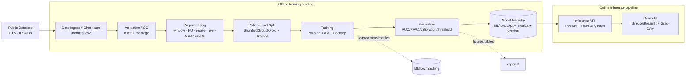

# Kế hoạch Nghiên cứu & Phát triển 6 tuần — AI Phát hiện Ung thư Gan trên ảnh CT

> **Vai trò:** Principal AI Research Scientist (Medical CV / Medical Imaging / MLOps).
> **Bài toán:** Xây dựng mô hình AI phát hiện & phân loại tổn thương ung thư gan từ ảnh y tế; đánh giá bằng Accuracy, Sensitivity, Specificity, AUC; triển khai demo hoàn chỉnh.
> **Nhân sự:** 1 AI Engineer/Researcher + hỗ trợ coding/AI agent · **Thời gian:** 6 tuần.
> **Định vị:** Công cụ **nghiên cứu / hỗ trợ quyết định**, KHÔNG phải thiết bị chẩn đoán lâm sàng đã kiểm định.
>
> *Tài liệu này được viết đủ chi tiết để một AI coding agent chuyển từng đầu việc thành code và GitHub Issue.*

---

## Mục lục

1. [Executive summary](#1-executive-summary)
2. [Phân tích & lựa chọn phạm vi bài toán](#2-phân-tích--lựa-chọn-phạm-vi-bài-toán)
3. [Problem statement cuối cùng](#3-problem-statement-cuối-cùng)
4. [So sánh dataset public](#4-so-sánh-dataset-public)
5. [Dataset được lựa chọn](#5-dataset-được-lựa-chọn)
6. [Input, Output và Labels](#6-input-output-và-labels)
7. [Data protocol](#7-data-protocol)
8. [Preprocessing và augmentation](#8-preprocessing-và-augmentation)
9. [Mô hình](#9-mô-hình)
10. [Experiment matrix](#10-experiment-matrix)
11. [Evaluation protocol](#11-evaluation-protocol)
12. [Explainability và error analysis](#12-explainability-và-error-analysis)
13. [Kiến trúc hệ thống](#13-kiến-trúc-hệ-thống)
14. [Thiết kế demo](#14-thiết-kế-demo)
15. [Repository structure](#15-repository-structure)
16. [Kế hoạch 6 tuần](#16-kế-hoạch-6-tuần)
17. [Timeline chi tiết](#17-timeline-chi-tiết-theo-work-package)
18. [Milestones](#18-milestones)
19. [Definition of Done](#19-definition-of-done)
20. [Risk register](#20-risk-register)
21. [Phần cứng và technology stack](#21-phần-cứng-và-technology-stack)
22. [Cấu trúc tài liệu cuối](#22-cấu-trúc-tài-liệu-cuối)
23. [Câu hỏi nghiên cứu](#23-câu-hỏi-nghiên-cứu)
24. [Checklist cho GitHub Issues / Project board](#24-checklist-cho-github-issues--project-board)
- [Phụ lục — Bảng tổng kết & Critical Path](#phụ-lục--bảng-tổng-kết--critical-path)

---

## 1. Executive summary

**Điều được xây dựng.** Một pipeline nghiên cứu **tái lập được**, đi từ ảnh CT gan thô đến dự đoán, cho bài toán **phân loại nhị phân ở mức lát cắt (slice-level)**: *một lát cắt CT bụng có chứa tổn thương gan (positive) hay là gan bình thường (negative)*, sau đó **tổng hợp lên mức bệnh nhân (patient/volume-level)**. Đây là proxy cho bài toán "phát hiện ung thư gan" và được định vị là công cụ **triage/hỗ trợ**, không thay bác sĩ.

**Vì sao chọn hướng này.** Trong ràng buộc 6 tuần / 1 người / GPU khiêm tốn, hướng 2D slice-level classification là điểm cân bằng tốt nhất giữa: (a) **dữ liệu public chất lượng, có thể tải ngay** (LiTS + 3D-IRCADb-01), (b) **nhãn suy ra được đáng tin** từ mask chuyên gia, (c) **phần cứng nhẹ** (ảnh 2D 256–512 px), (d) **demo trực quan mạnh** (upload ảnh/volume → xác suất + Grad-CAM overlay), và (e) **đo được Accuracy/Sensitivity/Specificity/AUC một cách khoa học** với patient-level split.

**Cách đo thành công (không hứa con số tuyệt đối).** Tiêu chí là: pipeline chạy end-to-end; **split ở mức bệnh nhân, không leakage**; mô hình chính **vượt baseline** một cách ổn định qua nhiều fold/seed; báo cáo đầy đủ ROC/PR/confusion matrix + **95% CI bootstrap**; có **Grad-CAM** kiểm chứng mô hình nhìn vào vùng gan/tổn thương; demo Docker chạy được; tài liệu (README, model card, data card, limitations, disclaimer) đầy đủ.

**Ba deliverable trọng tâm:**
1. **Reproducible training/eval pipeline** (config-driven, seed-fixed, patient-level split, MLflow tracking).
2. **Benchmark có kiểm soát**: custom CNN → pretrained CNN → augmentation → class-imbalance handling → fine-tuning → threshold optimization → external test.
3. **Demo Docker** (Gradio/Streamlit + FastAPI) upload ảnh/volume → nhãn + xác suất + ngưỡng + heatmap + disclaimer.

**Ranh giới an toàn.** Không phải hệ thống chẩn đoán; không phân biệt chắc chắn lành/ác tính (dữ liệu không đủ nhãn mô bệnh học); không dùng test set để chọn model/threshold; không báo cáo Accuracy đơn lẻ; nêu rõ domain shift và limitations.

---

## 2. Phân tích & lựa chọn phạm vi bài toán

Ung thư gan có thể tiếp cận trên CT, MRI, siêu âm, mô bệnh học. Với 6 tuần **không được chọn phạm vi quá rộng**. Dưới đây là 5 hướng khả thi được chấm điểm.

### 2.1. Năm hướng ứng viên

| # | Hướng | Đơn vị dự đoán | Nhãn cần |
|---|-------|----------------|----------|
| A | **CT slice-level: tổn thương gan có/không** (detection proxy) | Lát cắt → gộp patient | Suy từ mask u (LiTS) |
| B | **Histopathology patch: HCC tumor vs non-tumor** | Patch WSI → gộp slide | Từ mask WSI (PAIP/TCGA-LIHC) |
| C | **Ultrasound gan: bình thường/tổn thương** | Ảnh US | Nhãn ảnh |
| D | **ROI-level: lành tính vs ác tính** | ROI đã crop | Nhãn lành/ác đã xác nhận |
| E | **3D volume classification: bệnh nhân có u/không** | Volume | Nhãn bệnh nhân |

### 2.2. Bảng so sánh theo tiêu chí plan.md

Thang điểm 1–5 (5 = tốt nhất cho ràng buộc 6 tuần).

| Tiêu chí | A. CT slice | B. Histo patch | C. Ultrasound | D. ROI lành/ác | E. 3D volume |
|---|:--:|:--:|:--:|:--:|:--:|
| Phù hợp "phát hiện/phân loại ung thư gan" | 4 | 5 | 3 | 5 | 4 |
| Dữ liệu public tải được ngay | **5** (LiTS, IRCADb) | 3 (PAIP cần xin quyền) | 2 (ít nguồn chuẩn) | 2 (hiếm nhãn lành/ác tin cậy) | 4 (cùng LiTS) |
| Độ khó tiền xử lý | 3 (DICOM/NIfTI, windowing) | 2 (WSI, tiling, stain) | 4 (ảnh 2D sẵn) | 4 | 2 (3D nặng) |
| Yêu cầu phần cứng | **4** (2D nhẹ) | 3 (nhiều patch) | 5 | 4 | 1 (VRAM lớn) |
| Hoàn thành trong 6 tuần | **5** | 3 | 4 | 3 | 2 |
| Đạt Acc/Sens/Spec/AUC đáng tin | **4** | 4 | 3 | 3 (dataset nhỏ → CI rộng) | 3 |
| Demo trực quan | **5** (heatmap trên ảnh CT) | 4 | 4 | 3 | 3 |
| Rủi ro leakage/đánh giá lệch | 3 (cần patient-split kỹ) | 3 (slide-split) | 3 | 2 | 4 |
| **Tổng (không trọng số)** | **33** | 27 | 28 | 26 | 23 |

### 2.3. Nhận định & lựa chọn

- **Hướng D (lành/ác)** đúng bài toán nhất về mặt lâm sàng nhưng **thiếu dữ liệu public có nhãn mô bệnh học đáng tin** trong 6 tuần → CI rộng, rủi ro overclaim. Loại khỏi vai trò chính.
- **Hướng E (3D)** quá nặng cho GPU khiêm tốn và dễ overfit với ~131 bệnh nhân → để dành như *stretch*.
- **Hướng B (histopathology)** rất mạnh về "đúng là ung thư" và demo đẹp, nhưng WSI + tiling + stain normalization + xin quyền PAIP là **rủi ro tiến độ tuần 1**. Giữ làm **hướng thay thế** nếu CT gặp trở ngại.
- **Hướng C (siêu âm)** nhẹ nhưng nguồn public chuẩn hóa yếu → khó tái lập.
- ✅ **Hướng A (CT slice-level detection proxy)** thắng vì dữ liệu chắc chắn tải được, phần cứng nhẹ, demo mạnh, đo metric khoa học được, và có sẵn **external test độc lập (3D-IRCADb-01)**.

> **Nguyên tắc thu hẹp (theo plan.md §2.4):** KHÔNG thêm segmentation/detection/3D/multimodal chỉ để "trông phức tạp". Segmentation của LiTS **chỉ được dùng để suy nhãn slice**, không phải mục tiêu chính. Object detection/3D là *nice-to-have*, chỉ làm khi tiến độ cho phép.

### 2.4. Giả định được ghi rõ (không hỏi lại người dùng)

- **GĐ-1:** "Phát hiện ung thư gan" được hiện thực hóa (MVP) thành **phát hiện tổn thương gan bất thường** (predominantly malignant: HCC + di căn) so với **gan bình thường**, ở mức lát cắt rồi gộp bệnh nhân. Không tách lành/ác vì thiếu nhãn.
- **GĐ-2:** Ảnh nền là **CT bụng** (có/không cản quang tùy volume). Không giới hạn 1 phase vì LiTS chủ yếu là ảnh đơn phase/hỗn hợp.
- **GĐ-3:** Phần cứng thực tế giả định **GPU ~4–8 GB VRAM local** cho phát triển; **training chính chạy trên cloud GPU (16 GB, ví dụ Colab/Kaggle/VM T4)**. Nếu không có cloud, fallback ảnh 256 px + batch nhỏ + ResNet-18.
- **GĐ-4:** Positive = "slice có tổn thương gan"; Negative = "slice có gan nhưng không tổn thương". Slice không chứa gan bị **loại** khỏi tập (hoặc gộp negative với cờ riêng — xem §7).

---

## 3. Problem statement cuối cùng

> **"Cho đầu vào là một lát cắt CT bụng (axial slice) chứa gan — hoặc một volume CT gan để suy ra dự đoán mức bệnh nhân — mô hình dự đoán *xác suất lát cắt/bệnh nhân có tổn thương gan bất thường (nghi ngờ ác tính)*, tại **mức slice** (đơn vị chính) và **mức patient** (gộp từ slice), với mục tiêu **hỗ trợ sàng lọc/triage và làm nổi bật vùng cần bác sĩ xem lại**, KHÔNG thay thế quyết định của bác sĩ và KHÔNG phân biệt lành/ác tính đã được xác nhận mô bệnh học."**

**Đặc tả kỹ thuật gọn:**
- **Task type:** Binary classification (mở rộng multiclass là *nice-to-have*, xem §6.4).
- **Positive class (dùng cho Sensitivity):** slice/bệnh nhân **có** tổn thương gan.
- **Negative class (dùng cho Specificity):** slice/bệnh nhân **gan bình thường** (không tổn thương).
- **Đơn vị dự đoán chính:** *slice*; **đơn vị báo cáo lâm sàng:** *patient* (gộp bằng top-k mean / max, xem §11).
- **Định vị:** *Research prototype / decision-support*, luôn kèm disclaimer y tế.

**Chuyển nhãn (label transfer) & hạn chế khoa học** (bắt buộc nêu theo plan.md §3):
- Nhãn slice **suy từ mask u của chuyên gia** trong LiTS: `positive` nếu diện tích mask tumor trên slice ≥ ngưỡng `τ_area` (ví dụ ≥ 10 px, để loại nhiễu mask ở rìa); `negative` nếu slice có mask gan nhưng **không** có mask tumor.
- **Hạn chế:** (1) LiTS gồm HCC **và di căn** → "positive" nghĩa là *tổn thương ác tính nói chung*, không thuần HCC; (2) không có nhãn lành tính đã xác nhận → mô hình **không** học được ranh giới lành/ác; (3) nhãn slice **tương quan trong cùng bệnh nhân** → bắt buộc patient-level split, và không được coi mỗi slice là một mẫu độc lập khi báo cáo CI; (4) tổn thương rất nhỏ/isoattenuating có thể bị chính mask bỏ sót → nhãn nhiễu nhẹ.

---

## 4. So sánh dataset public

> **Nguyên tắc:** Không bịa tên/URL/số liệu. Số liệu dưới đây lấy từ mô tả benchmark; **cần đối chiếu lại trang nguồn khi tải** (đánh dấu *⚠ verify*).

### 4.1. Bảng so sánh chi tiết

| Thuộc tính | **LiTS** (chính) | **3D-IRCADb-01** (external test) | **MSD Task03 Liver** (mirror) | **CHAOS** (negatives phụ) |
|---|---|---|---|---|
| Nguồn chính thức | LiTS Challenge / CodaLab; paper [arXiv:1901.04056](https://arxiv.org/abs/1901.04056), [ScienceDirect](https://www.sciencedirect.com/science/article/pii/S1361841522003085) | [IRCAD](https://www.ircad.fr/research/data-sets/liver-segmentation-3d-ircadb-01/) | [medicaldecathlon.com](http://medicaldecathlon.com/) | CHAOS Grand Challenge |
| Loại ảnh | CT bụng | CT bụng | CT bụng | CT + MRI bụng |
| Định dạng | NIfTI (`.nii`) | DICOM + VTK masks | NIfTI | DICOM |
| Số bệnh nhân | **131 train + 70 test** (201) | **20** | 131 train + 70 test (=LiTS) | ~40 CT / ~120 MRI *⚠ verify* |
| Số ảnh/slice | ~**58,638** slice train | ~74–260 slice/bn | như LiTS | *⚠ verify* |
| Nhãn có sẵn | Mask **gan + u** | Mask **gan + mạch + u** | Mask gan + u | Mask **gan** (không u) |
| Loại tổn thương | HCC + di căn (hỗn hợp) | U gan ở ~75% ca | như LiTS | — (chỉ organ) |
| Mask/ROI | Voxel mask | Voxel mask | Voxel mask | Voxel mask (gan) |
| Điều kiện truy cập | Đăng ký challenge/mirror | Tải free (đăng ký IRCAD) | Tải free | Đăng ký challenge |
| License | Theo điều khoản challenge *⚠ verify* | Theo điều khoản IRCAD *⚠ verify* | CC-BY-SA 4.0 *⚠ verify* | Theo challenge *⚠ verify* |
| Dùng cho research/demo | Có (kiểm tra terms) | Có (kiểm tra terms) | Có | Có |
| Ưu điểm | Lớn, đa trung tâm, mask u chuẩn | Có mask u, độc lập LiTS → external test tốt | Mirror dễ tải của LiTS | Nhiều slice gan **không u** → làm giàu negative |
| Hạn chế | Không nhãn lành/ác; imbalance slice | **Rất nhỏ (20 bn)** → CI rộng | **Trùng LiTS** → KHÔNG dùng chung (leakage) | Không có nhãn u |
| Rủi ro imbalance | Cao (positive slice ≪ negative) | Trung bình | Cao | — |
| Rủi ro leakage/trùng bn | Cao nếu split theo slice | Thấp (giữ hoàn toàn hold-out) | **Rất cao** nếu dùng cùng LiTS | Trung bình |
| Phù hợp 6 tuần | ⭐⭐⭐⭐⭐ | ⭐⭐⭐⭐ (external) | ⭐ (chỉ mirror) | ⭐⭐⭐ (bổ trợ) |

### 4.2. Cảnh báo quan trọng về leakage giữa dataset

- **MSD Task03 Liver = LiTS** (cùng training set). **TUYỆT ĐỐI không** trộn hai nguồn này vào train/test khác nhau → sẽ là data leakage. MSD chỉ đóng vai trò *mirror tải thay thế* nếu link LiTS gặp trục trặc.
- **3D-IRCADb-01** được cho là **độc lập** với LiTS (khác cohort). Vẫn nên kiểm tra trùng lặp cơ học (hash volume, số slice, spacing) trước khi coi là external.

### 4.3. Hướng dữ liệu thay thế (nếu CT gặp trở ngại tuần 1)

- **Histopathology (hướng B):** PAIP 2019 (HCC WSI segmentation — cần đăng ký/được duyệt, *⚠ có thể chậm*), TCGA-LIHC trên TCIA (WSI + CT/MR, cần tiling + gán nhãn yếu). Ưu tiên nếu muốn "đúng là ung thư" hơn.
- **HCC-specific CT:** WAW-TACE (Zenodo, HCC đa thì, ~233 bn *⚠ verify*), HCC-TACE-Seg (TCIA, ~105 bn *⚠ verify*) — thuần HCC nhưng phức tạp đa thì hơn LiTS.

---

## 5. Dataset được lựa chọn

| Vai trò | Dataset | Lý do |
|---|---|---|
| **Chính (development)** | **LiTS** (131 bn có mask) | Đủ lớn, mask u chuẩn, tải được, đa trung tâm → học & cross-validation |
| **Backup/mirror tải** | **MSD Task03 Liver** | Cùng dữ liệu LiTS, host khác — dùng khi link chính lỗi (KHÔNG phải nguồn độc lập) |
| **External test** | **3D-IRCADb-01** | Cohort độc lập, có mask u → đo generalization/domain shift |
| **Negative enrichment (optional)** | **CHAOS (CT)** | Bổ sung slice gan **không u** để cân bằng lớp, *nice-to-have* |

**Quy tắc dùng dữ liệu (data governance):**
- **Không commit ảnh y tế thô** vào repo. Chỉ commit *manifest* (đường dẫn tương đối, hash, nhãn), *split file*, *config*, và script tải.
- Ghi rõ **license & terms** của từng nguồn trong `DATA_CARD.md`; nếu terms không cho redistribute → chỉ hướng dẫn người dùng tự tải.
- Lưu **checksum (SHA-256)** mọi file tải để đảm bảo tái lập.

---

## 6. Input, Output và Labels

### 6.1. Input

- **Slice-level (đơn vị chính):** một ảnh axial 2D lấy từ volume CT, đã windowing về vùng gan (xem §8), resize về `H×W` (mặc định 256×256 hoặc 512×512), nhân 3 kênh (grayscale→3ch) để dùng ImageNet-pretrained.
- **Patient-level (inference/demo):** một volume CT (NIfTI/DICOM series) → tách thành các slice hợp lệ (có gan) → dự đoán từng slice → gộp.
- **Metadata kèm theo:** `patient_id`, `slice_index`, `pixel_spacing`, `slice_thickness`, `window`, `has_liver`, `phase` (nếu có).

### 6.2. Output

- **Slice-level:** `p ∈ [0,1]` = P(tổn thương). Nhãn = `positive` nếu `p ≥ threshold` (ngưỡng chọn trên **validation**, §11).
- **Patient-level:** điểm gộp `P_patient` (ví dụ mean của top-k slice-prob) + nhãn + số slice nghi ngờ + chỉ số bất định.
- **Kèm:** ngưỡng đang dùng, model version, tóm tắt preprocessing, **Grad-CAM heatmap**, và **disclaimer** "Research use only".

### 6.3. Định nghĩa nhãn (label spec)

```text
Cho mỗi slice s của bệnh nhân p:
  liver_area(s)  = số voxel thuộc mask gan trên slice s
  tumor_area(s)  = số voxel thuộc mask u trên slice s
  has_liver(s)   = liver_area(s) >= τ_liver         # vd τ_liver = 50 px
  label(s):
      = 1 (positive)  nếu tumor_area(s) >= τ_area    # vd τ_area = 10 px
      = 0 (negative)  nếu has_liver(s) và tumor_area(s) < τ_area
      = EXCLUDE        nếu not has_liver(s)           # slice không chứa gan
```

- **Lớp positive = 1** → tính **Sensitivity/Recall/TPR**.
- **Lớp negative = 0** → tính **Specificity/TNR**.
- `τ_area`, `τ_liver` là **siêu tham số của protocol dữ liệu**, phải chốt tuần 1 và ghi vào `configs/`.

### 6.4. Nhị phân vs multiclass & quy đổi metric

- **Mặc định: binary.** Sens = TP/(TP+FN), Spec = TN/(TN+FP), AUC = ROC-AUC của `p`.
- **Nếu mở rộng multiclass (nice-to-have)** — ví dụ {normal, small-lesion, large-lesion} theo kích thước — thì:
  - Sens/Spec tính **one-vs-rest** cho lớp bệnh lý gộp (mọi lớp ≠ normal = positive).
  - AUC báo cáo **macro-average one-vs-rest** + per-class.
  - Vẫn ưu tiên **binary "abnormal vs normal"** làm metric quyết định để tránh dàn trải.

### 6.5. Xử lý bệnh nhân nhiều tổn thương & gộp slice→patient

- Một bệnh nhân có nhiều tổn thương ⇒ nhiều slice positive rải rác. Không cần đếm số u; chỉ cần **có ≥1 vùng nghi ngờ** là patient-positive.
- **Aggregation slice→patient:** `P_patient = mean(top_k(p_slices))` với `k` nhỏ (vd k=3) để bền với nhiễu; báo cáo cả biến thể `max`. Ngưỡng patient chọn riêng trên validation.

### 6.6. Tiêu chí Inclusion / Exclusion

| Loại | Quy tắc |
|---|---|
| **Inclusion** | Volume CT bụng có mask gan hợp lệ; slice `has_liver = true` |
| **Exclusion** | Slice không chứa gan; volume lỗi/hỏng header; spacing bất thường; mask rỗng toàn bộ; ảnh có artifact nặng (ghi log, không âm thầm bỏ) |
| **Cờ (không loại)** | Missing phase/contrast unknown; slice thickness lớn; near-duplicate → giữ nhưng gắn cờ để phân tích |

---

## 7. Data protocol

### 7.1. Data audit (kiểm tra dữ liệu — chạy tuần 1)

Xuất một `data_audit_report.html/csv` trả lời:

- [ ] **Phân bố lớp** ở slice-level và patient-level (kỳ vọng: positive slice ≪ negative).
- [ ] **Số bệnh nhân**, **số slice/bệnh nhân** (min/median/max), tổng slice hợp lệ.
- [ ] **Kích thước ảnh** (thường 512×512), **pixel spacing**, **slice thickness**, **số slice/volume**.
- [ ] **Scanner/protocol** nếu header có; **có/không cản quang**, **phase** (nếu suy được).
- [ ] **Missing data** (mask rỗng, header thiếu), **corrupted files** (không đọc được), **duplicate/near-duplicate** (hash + perceptual hash).
- [ ] **Metadata làm lộ nhãn** (ví dụ tên series chứa "tumor"), **chữ/marker/tên viện in trên ảnh** (burned-in annotation) → nguồn **shortcut learning**.
- [ ] **HU range** hợp lý (loại volume có HU bất thường → có thể đã bị chuẩn hóa sẵn).
- [ ] **Kiểm tra khớp ảnh–mask** (cùng shape/affine); vẽ **QC montage** 20–30 ca (overlay mask lên ảnh).

### 7.2. Chia tập dữ liệu — **bắt buộc mức bệnh nhân**

> **Không bao giờ** để các slice của cùng một bệnh nhân rơi vào nhiều tập. Chia **theo `patient_id`**, **stratify theo patient-level label** (có/không u) và, nếu được, theo tỷ lệ positive-slice.

**Đề xuất tỷ lệ (LiTS 131 bn có mask):**

| Tập | Tỷ lệ | Số bn (xấp xỉ) | Mục đích |
|---|---|---|---|
| Train | 70% | ~92 | Học tham số |
| Validation | 15% | ~20 | Chọn model, tune threshold, early stopping |
| Internal test | 15% | ~19 | Đánh giá cuối, **chỉ chạm 1 lần** |
| **External test** | 100% 3D-IRCADb-01 | 20 | Generalization, **hoàn toàn hold-out** |

**Vì dataset nhỏ**, ưu tiên **Stratified Group K-Fold (k=5)** + báo cáo **mean±std** qua fold và **bootstrap 95% CI** ở patient-level. Có thể **repeated CV** (vd 5×2) nếu thời gian cho phép. Internal test hold-out vẫn giữ để có một đánh giá "một lần".

**Python skeleton — patient-level stratified split:**

```python
import numpy as np, pandas as pd
from sklearn.model_selection import StratifiedGroupKFold, train_test_split

# manifest: mỗi dòng = 1 slice; cột: patient_id, slice_label(0/1)
def patient_level_label(df):
    # bệnh nhân positive nếu có >=1 slice positive
    return df.groupby("patient_id")["slice_label"].max()

def make_holdout_and_folds(manifest_csv, seed=42, k=5, test_frac=0.15):
    df = pd.read_csv(manifest_csv)
    pat = patient_level_label(df).reset_index()          # patient_id, y
    # 1) tách internal test ở MỨC BỆNH NHÂN, stratify theo y
    trainval_ids, test_ids = train_test_split(
        pat["patient_id"], test_size=test_frac,
        stratify=pat["y"], random_state=seed)
    tv = pat[pat.patient_id.isin(trainval_ids)]
    # 2) K-fold nhóm theo bệnh nhân, stratify theo y
    sgkf = StratifiedGroupKFold(n_splits=k, shuffle=True, random_state=seed)
    folds = []
    X = tv["patient_id"].values; y = tv["y"].values; groups = tv["patient_id"].values
    for tr, va in sgkf.split(X, y, groups):
        folds.append((X[tr].tolist(), X[va].tolist()))
    assert set(test_ids).isdisjoint(trainval_ids)         # không trùng bệnh nhân
    return {"test": test_ids.tolist(), "folds": folds}
    # -> lưu ra JSON kèm seed để tái lập; assert không giao nhau giữa mọi tập
```

> **Assertion leakage bắt buộc (unit test):** với mọi cặp tập, `set(patient_ids_A) ∩ set(patient_ids_B) == ∅`. Test này chạy trong CI.

### 7.3. Versioning dữ liệu

- `dataset_version = vX.Y` gắn với: manifest hash, danh sách bệnh nhân, `τ_area/τ_liver`, preprocessing config.
- Mọi experiment ghi lại `dataset_version` để truy vết.

---

## 8. Preprocessing và augmentation

### 8.1. Preprocessing pipeline (CT)

| Bước | Bắt buộc? | Chi tiết | Ghi chú 6 tuần |
|---|:--:|---|---|
| Load NIfTI/DICOM | ✅ | `nibabel`/`pydicom`/`SimpleITK`; đọc affine, spacing | — |
| Chuẩn orientation | ✅ | Đưa về RAS/LPS nhất quán | tránh lật trái/phải |
| **Windowing gan** | ✅ | Window level/width vùng gan, vd **WL≈40–60, WW≈150–400 HU** (chốt 1 giá trị + ablation) | quan trọng nhất cho tương phản |
| **HU clipping** | ✅ | Clip về [−100, 300] HU (hoặc theo window) rồi scale [0,1] | ổn định đầu vào |
| Normalize | ✅ | Sau clip: scale [0,1] rồi chuẩn theo mean/std ImageNet nếu dùng pretrained | — |
| Resample spacing | ⬜ optional | Resample về in-plane spacing đồng nhất (vd 1×1 mm) | tốt cho generalization; có thể bỏ nếu chậm |
| Resize/pad/crop | ✅ | Resize slice về 256×256 (mặc định) hoặc 512×512 | 256 để nhẹ GPU |
| **Liver ROI crop** | ⬜ khuyến nghị | Crop quanh bbox gan (từ mask khi train; từ liver-segmentor hoặc center-crop khi infer) | giảm nền, tăng SNR; nếu không có mask lúc infer → center/heuristic crop |
| Loại slice không gan | ✅ | Theo `has_liver` | giảm nhiễu nhãn |
| Grayscale→3 kênh | ✅ | Nhân 3 để hợp pretrained | hoặc 3 window khác nhau (multi-window) *nice-to-have* |
| Cache | ✅ | Lưu slice đã xử lý ra `.npy`/`.png` + manifest | tăng tốc training |

**Bước KHÔNG phù hợp trong 6 tuần:** bias field correction (đặc thù MRI, không cần cho CT); registration đa thì (không cần vì làm single-slice); full 3D resampling nặng (optional).

### 8.2. Data augmentation (dùng **Albumentations**)

**Chọn Albumentations** vì: nhanh (nền OpenCV), API 2D gọn hợp với slice-level, tích hợp PyTorch dễ. (MONAI/TorchIO để dành nếu chuyển 3D.)

| Augmentation | Dùng? | Tham số gợi ý | Lý do / an toàn giải phẫu |
|---|:--:|---|---|
| Horizontal flip | ✅ | p=0.5 | Gan trái/phải theo trục ngang — hợp lý ở mức phát hiện tổn thương |
| Vertical flip | ⬜ | thường **tắt** | dễ sai giải phẫu (trên/dưới) |
| Small rotation | ✅ | ±10–15° | biến thể tư thế |
| Translation/scale (ShiftScaleRotate) | ✅ | shift 0.0625, scale 0.1 | robust vị trí/kích thước |
| Random crop / RandomResizedCrop | ✅ | scale 0.8–1.0 | regularize |
| Brightness/Contrast | ✅ | ±0.2 | mô phỏng khác biệt window/scanner |
| Gaussian noise | ✅ | var nhỏ | robust nhiễu đầu dò |
| Gaussian blur (nhẹ) | ⬜ | p=0.1 | mô phỏng ảnh mờ |
| Elastic transform | ⬜ optional | rất nhẹ | chỉ khi không méo tổn thương |
| CLAHE | ⬜ optional | — | tăng tương phản cục bộ |
| CutMix/MixUp | ⬜ *nice-to-have* | — | có thể phá ý nghĩa tổn thương → thận trọng |

**Cấm:** augmentation làm đổi nhãn hoặc sai giải phẫu (lật dọc mạnh, biến dạng lớn xóa tổn thương, cắt mất vùng gan khi slice positive).

**Validation/test: KHÔNG augment** (chỉ resize + normalize; TTA là *nice-to-have*, nếu dùng phải cố định và báo cáo).

### 8.3. Ví dụ pipeline Albumentations

```python
import albumentations as A
from albumentations.pytorch import ToTensorV2

train_tf = A.Compose([
    A.HorizontalFlip(p=0.5),
    A.ShiftScaleRotate(shift_limit=0.0625, scale_limit=0.1,
                       rotate_limit=15, border_mode=0, p=0.5),
    A.RandomBrightnessContrast(0.2, 0.2, p=0.5),
    A.GaussNoise(var_limit=(5.0, 20.0), p=0.2),
    A.Resize(256, 256),
    A.Normalize(mean=(0.485, 0.456, 0.406), std=(0.229, 0.224, 0.225)),
    ToTensorV2(),
])
val_tf = A.Compose([
    A.Resize(256, 256),
    A.Normalize(mean=(0.485, 0.456, 0.406), std=(0.229, 0.224, 0.225)),
    ToTensorV2(),
])
```

---

## 9. Mô hình

Lộ trình **tăng dần độ phức tạp**, mỗi bước có lý do rõ.

### 9.1. Baseline đơn giản (hoàn thành tuần 2)

**(a) Custom small CNN** — để có sàn tham chiếu & kiểm tra pipeline:
- 4–5 khối `Conv(3×3)-BN-ReLU-MaxPool`, GAP, FC → 1 logit. ~1–3M params.

**(b) Pretrained CNN** — **ResNet-18/50 (ImageNet)** làm baseline mạnh đầu tiên.

| Hyperparameter | Giá trị baseline |
|---|---|
| Loss | `BCEWithLogitsLoss` (+ `pos_weight` cho imbalance) |
| Optimizer | AdamW (wd=1e-4) |
| Learning rate | 3e-4 (head) / 1e-4 (backbone khi fine-tune) |
| Batch size | 32 @256px (giảm còn 8–16 nếu VRAM 4GB) |
| Epochs | 30–50 với **early stopping** (patience 7 trên val AUC/AP) |
| LR scheduler | Cosine annealing hoặc ReduceLROnPlateau |
| Class imbalance | `pos_weight` = N_neg/N_pos **hoặc** `WeightedRandomSampler` |
| Seed | cố định (42, 1, 2 cho 3-seed runs) |
| Mixed precision | AMP bật (tiết kiệm VRAM) |

> Baseline đủ đơn giản để **chốt kết quả đầu tiên cuối tuần 2**.

### 9.2. Mô hình chính (tối đa 2–3, tránh dàn trải)

| Model | Vì sao chọn | Trade-off |
|---|---|---|
| **ResNet-50** (chủ lực) | Cân bằng độ mạnh/tốc độ, Grad-CAM dễ, tài liệu nhiều | Không SOTA tuyệt đối |
| **EfficientNet-B0/B1** | Ít params, hiệu quả/VRAM tốt, generalize tốt | Nhạy hyperparameter hơn |
| **DenseNet-121** (dự phòng) | Thường mạnh trên ảnh y tế 2D, feature reuse | Chậm hơn, tốn bộ nhớ activation |

**Loại khỏi phạm vi chính (nêu lý do):** ConvNeXt/ViT/Swin cần nhiều dữ liệu & tuning → rủi ro với ~131 bn; **2.5D CNN** là *nice-to-have* hợp lý (ghép 3 slice lân cận thành 3 kênh — tận dụng ngữ cảnh mà vẫn nhẹ); **3D CNN** để *stretch* vì VRAM/thời gian.

- **Slice→patient aggregation** (đã nêu §6.5): mean-of-top-k + max; chọn trên validation.
- **2.5D (nếu làm):** input = slice `[i-1, i, i+1]` làm 3 kênh; nhãn theo slice giữa `i`.
- **3D (nếu stretch):** MONAI 3D ResNet trên volume crop gan; **fallback = 2.5D/2D** nếu quá 1 ngày không hội tụ.

### 9.3. Transfer learning

- **ImageNet pretrained** là mặc định (medical-pretrained như RadImageNet là *nice-to-have*, *⚠ verify* license/khả dụng).
- **Chiến lược 2 pha:** (1) **freeze backbone**, train head vài epoch để ổn định; (2) **gradual unfreezing** + **discriminative LR** (backbone LR nhỏ hơn head ~10×); cuối cùng fine-tune toàn bộ với LR nhỏ.
- Ghi lại phương án nào cho kết quả tốt nhất (là một thí nghiệm — E6).

### 9.4. Loss & mất cân bằng dữ liệu

| Phương án | Khi nào dùng |
|---|---|
| **BCE + `pos_weight`** (mặc định) | Điểm khởi đầu, đơn giản, hiệu quả |
| **Weighted CE / Focal loss (γ=2)** | Khi positive rất hiếm & nhiều "easy negative" |
| **WeightedRandomSampler / Oversampling** | Khi muốn cân bằng batch thay vì trọng số loss |
| **Label smoothing (0.05–0.1)** | Giảm overconfidence, cải thiện calibration |

**Lựa chọn chính:** BCE + `pos_weight` **hoặc** WeightedRandomSampler. **Chuyển sang Focal loss** nếu sau E4 recall lớp positive vẫn thấp dù đã cân bằng. Mỗi thay đổi = một experiment riêng (E4/E5).

---

## 10. Experiment matrix

**Nguyên tắc:** mỗi thí nghiệm đổi **một** yếu tố có lý do; không "fold đẹp nhất"; mọi run log MLflow. Metric chính = **patient-level ROC-AUC** (phụ: AP/PR-AUC, Sens@fixed-Spec).

| ID | Mục tiêu | Model | Pretrained | Aug | Loss | Sampling | Eval level | Metric chính | Giữ/loại |
|---|---|---|---|---|---|---|---|---|---|
| **E0** | Sanity: overfit 3–5 ca | Custom CNN | ✗ | ✗ | BCE | — | slice | loss↓~0 | Giữ nếu overfit được (pipeline đúng) |
| **E1** | CNN baseline | Custom CNN | ✗ | ✗ | BCE+pw | — | slice+patient | AUC | Làm sàn tham chiếu |
| **E2** | Pretrained no-aug | ResNet-50 | ✓ | ✗ | BCE+pw | — | patient | AUC | Giữ nếu > E1 |
| **E3** | Pretrained + aug | ResNet-50 | ✓ | ✓ | BCE+pw | — | patient | AUC | Giữ nếu ≥ E2 |
| **E4** | Weighted loss vs sampler | ResNet-50 | ✓ | ✓ | BCE+pw | WRS | patient | Sens@Spec=0.90 | Chọn cách xử lý imbalance |
| **E5** | Focal loss | ResNet-50 | ✓ | ✓ | Focal | — | patient | Sens@Spec=0.90 | Giữ nếu recall↑ |
| **E6** | Fine-tuning strategy | ResNet-50 | ✓ | ✓ | best | best | patient | AUC | Freeze vs gradual unfreeze |
| **E7** | Model thứ 2 so sánh | EfficientNet-B0 | ✓ | ✓ | best | best | patient | AUC | So với ResNet-50 |
| **E8** | Threshold optimization | best model | — | — | — | — | patient | Youden J / Sens-priority | Chốt ngưỡng trên **val** |
| **E9** | Small ensemble (nice) | ResNet+EffNet | ✓ | ✓ | best | best | patient | AUC | Chỉ nếu còn thời gian |
| **E10** | **External test** | best model | — | — | — | — | patient | AUC + Δ so internal | Đo domain shift (báo cáo trung thực) |

**Ví dụ config YAML (E3):**

```yaml
# configs/exp/E3_resnet50_aug.yaml
experiment_id: E3
seed: 42
dataset:
  name: LiTS
  version: v1.0
  manifest: data/manifests/lits_v1.csv
  split: data/splits/lits_sgkfold_seed42.json
  tau_area: 10
  tau_liver: 50
input:
  representation: slice_2d       # slice_2d | slice_2p5d
  size: 256
  window: {wl: 50, ww: 350}
  channels: 3
model:
  arch: resnet50
  pretrained: imagenet
  num_classes: 1
train:
  loss: bce_with_logits
  pos_weight: auto               # = N_neg/N_pos theo fold
  optimizer: adamw
  lr_head: 3.0e-4
  lr_backbone: 1.0e-4
  weight_decay: 1.0e-4
  batch_size: 32
  epochs: 50
  amp: true
  scheduler: cosine
  early_stopping: {monitor: val_ap, patience: 7, mode: max}
augmentation: albumentations_default   # §8.3
eval:
  level: [slice, patient]
  patient_agg: {method: mean_topk, k: 3}
  primary_metric: patient_auroc
  bootstrap_n: 2000
tracking: {backend: mlflow, run_name: E3_resnet50_aug}
```

**Câu lệnh mẫu:**

```bash
# Train
python -m src.training.train --config configs/exp/E3_resnet50_aug.yaml
# Evaluate (internal test)
python -m src.evaluation.evaluate --config configs/exp/E3_resnet50_aug.yaml \
    --checkpoint outputs/E3/best.ckpt --split test
# External test
python -m src.evaluation.evaluate --config configs/exp/E3_resnet50_aug.yaml \
    --checkpoint outputs/E3/best.ckpt --external ircadb
```

---

## 11. Evaluation protocol

### 11.1. Công thức chỉ số (từ confusion matrix: TP, FP, TN, FN)

$$\text{Accuracy}=\frac{TP+TN}{TP+TN+FP+FN}\qquad \text{Sensitivity/Recall/TPR}=\frac{TP}{TP+FN}$$

$$\text{Specificity/TNR}=\frac{TN}{TN+FP}\qquad \text{Precision}=\frac{TP}{TP+FP}$$

$$F_1=\frac{2\cdot \text{Precision}\cdot \text{Recall}}{\text{Precision}+\text{Recall}}\qquad \text{Youden's }J=\text{Sens}+\text{Spec}-1$$

- **ROC-AUC:** diện tích dưới đường (FPR=1−Spec, TPR=Sens) khi quét threshold → **không phụ thuộc ngưỡng**.
- **PR-AUC (Average Precision):** diện tích dưới (Recall, Precision) — **quan trọng khi mất cân bằng** (positive hiếm).
- **Brier score:** $\frac{1}{N}\sum (p_i-y_i)^2$ — đo calibration.

> **Không chỉ báo cáo Accuracy** — với positive slice hiếm, một model đoán "toàn negative" vẫn có Accuracy cao nhưng Sens=0.

### 11.2. Metric chính/phụ & ngưỡng

- **Metric quyết định (model selection):** **patient-level ROC-AUC** (threshold-independent) + **PR-AUC**.
- **Metric phụ:** Sensitivity @ Specificity=0.90 (ưu tiên bắt sót ít), F1, Brier, calibration slope.
- **Ngưỡng mặc định:** 0.5, nhưng **ngưỡng vận hành chốt trên validation** bằng:
  - **Youden's J**: chọn threshold max `Sens+Spec−1`.
  - **Sensitivity-priority**: chọn threshold nhỏ nhất sao cho `Sens ≥ 0.90` (báo cáo Spec tại đó).
- **TUYỆT ĐỐI không** tối ưu threshold trên test set. Test chỉ áp ngưỡng đã khóa từ validation.
- **Báo cáo "Specificity tại Sensitivity mục tiêu"** (vd Spec @ Sens=0.90) — thông tin lâm sàng hữu ích hơn một điểm đơn.

### 11.3. Multiclass (nếu mở rộng)

- Macro / micro / weighted average cho Precision/Recall/F1.
- **One-vs-rest AUC** cho mỗi lớp + macro-average.

### 11.4. Độ tin cậy thống kê

- **Đơn vị lấy CI = bệnh nhân**, không phải slice (tránh phóng đại N). Với ~19 bn internal test → CI sẽ rộng, **phải nêu rõ**.
- **Bootstrap 95% CI** (resample **bệnh nhân**, 2000 lần) cho AUC/Sens/Spec.
- **Mean ± std qua 5 fold** và/hoặc **3 seed**.
- **So sánh model:** paired bootstrap trên cùng bệnh nhân; báo cáo Δ và CI, không chỉ p-value.

```python
# Bootstrap CI ở patient-level (rút gọn)
import numpy as np
from sklearn.metrics import roc_auc_score
def bootstrap_auc(y, p, n=2000, seed=42):
    rng = np.random.default_rng(seed); N=len(y); s=[]
    for _ in range(n):
        idx = rng.integers(0, N, N)            # resample BỆNH NHÂN
        if len(np.unique(y[idx])) < 2: continue
        s.append(roc_auc_score(y[idx], p[idx]))
    lo, hi = np.percentile(s, [2.5, 97.5])
    return float(np.mean(s)), float(lo), float(hi)
```

### 11.5. Biểu đồ/bảng báo cáo bắt buộc

ROC curve · PR curve · Confusion matrix (tại ngưỡng đã khóa) · Calibration curve + Brier · Bảng metric có 95% CI · Bảng per-fold.

### 11.6. Tránh các lỗi đánh giá (checklist)

- [ ] **Patient-level split** — test leakage assertion pass.
- [ ] Threshold & model selection **chỉ trên validation**.
- [ ] CI tính ở **patient-level** (không coi mỗi slice độc lập).
- [ ] Không báo cáo hàng chục nghìn slice như hàng chục nghìn mẫu độc lập.
- [ ] External test chạy **đúng một lần**, sau khi khóa mọi lựa chọn.
- [ ] Ghi rõ near-duplicate slice không rơi hai phía.

---

## 12. Explainability và error analysis

### 12.1. Phương pháp explainability

| Phương pháp | Vai trò | Ưu tiên |
|---|---|---|
| **Grad-CAM** | Heatmap vùng ảnh hưởng dự đoán; dễ tích hợp demo | ✅ chính |
| **Grad-CAM++** | Bản cải tiến, localize tốt hơn khi nhiều tổn thương | ✅ nếu kịp |
| Saliency map | Nhanh, nhưng nhiễu | ⬜ tham khảo |
| Integrated Gradients | Ổn định hơn saliency, attribution có cơ sở | ⬜ *nice-to-have* |

> **Giới hạn diễn giải (bắt buộc nêu):** Explainability **chỉ kiểm tra hành vi mô hình**, KHÔNG chứng minh mô hình "suy luận như bác sĩ". Heatmap **không phải bằng chứng lâm sàng**.

### 12.2. Kiểm tra hành vi mô hình

- **Mô hình có nhìn vào gan/tổn thương không?** Chồng Grad-CAM lên slice + mask gan; tính **tỷ lệ năng lượng heatmap nằm trong mask gan** (proxy định lượng, không phải chứng minh).
- **Phát hiện shortcut learning:** kiểm tra heatmap có bám vào **chữ/marker/rìa ảnh/giường bệnh** thay vì gan; kiểm tra hiệu năng có sụt khi che metadata/viền.
- **Hiển thị trong demo:** overlay heatmap bán trong suốt (opacity slider) trên slice gốc.

### 12.3. Error analysis framework

Xuất `error_analysis.csv` cho mọi ca sai + bảng review cho bác sĩ, phân tầng lỗi theo:

| Trục phân tích | Ví dụ nhóm |
|---|---|
| Loại lỗi | False positive / False negative |
| Kích thước tổn thương | <10mm / 10–30mm / >30mm |
| Số tổn thương | đơn / đa ổ |
| Vị trí | thùy phải/trái, gần mạch/rìa gan |
| Phase/contrast | có/không cản quang, phase khác nhau |
| Scanner/spacing | slice thickness, in-plane spacing |
| Chất lượng ảnh | artifact, nhiễu, mờ |
| ROI | crop gan đúng/sai |

**Mẫu bảng review lỗi cho bác sĩ/người đánh giá:**

| case_id | patient_id | slice | y_true | p_pred | thr | error_type | lesion_size_mm | note_bác_sĩ | GradCAM_hợp_lý? (Y/N) |
|---|---|---|---|---|---|---|---|---|---|
| … | … | … | 1 | 0.32 | 0.41 | FN | 8 | tổn thương nhỏ isoattenuating | N |

---

## 13. Kiến trúc hệ thống



**Thành phần & trách nhiệm:**

- **Offline pipeline:** ingest → QC → preprocessing/cache → split → train → eval → đăng ký model. Chạy trên máy có GPU/cloud.
- **Online pipeline:** FastAPI nhận ảnh/volume → preprocessing **giống hệt** offline (import chung `src/preprocessing`) → model → Grad-CAM → trả JSON + heatmap; UI hiển thị.
- **Model checkpoint & metadata:** lưu qua **MLflow** (params, metrics, artifacts) + `checkpoints/{exp}/best.ckpt`; mỗi model có `model_version`, preprocessing config hash, git commit.
- **Reproducibility:** seed cố định, config YAML versioned, split JSON, manifest hash, `requirements.txt` pin version, `Dockerfile`.

---

## 14. Thiết kế demo

**Stack (ưu tiên đơn giản):** **Gradio** (UI nhanh, tích hợp Python trực tiếp, dễ deploy Hugging Face Spaces) + **FastAPI** (REST endpoint cho tái sử dụng) + **PyTorch/ONNX Runtime** (serving) + **Docker**. Tracking training bằng **MLflow**.

> Chọn **Gradio** cho MVP vì dựng UI + upload + heatmap nhanh nhất trong tuần 5. Nếu cần tách backend/frontend rõ ràng → thêm FastAPI endpoint `/predict` gọi chung inference module.

**Chức năng tối thiểu (Must-have):**

1. **Upload** ảnh (PNG/JPG slice) **hoặc** volume (NIfTI/DICOM series `.zip`).
2. **Kiểm tra định dạng** & báo lỗi rõ ràng nếu file không hợp lệ/không chứa gan.
3. **Hiển thị ảnh đầu vào** (với volume: slider chọn slice; auto-chọn slice nghi ngờ nhất).
4. **Kết quả:** nhãn dự đoán · xác suất · **ngưỡng đang dùng** · **Grad-CAM overlay** (opacity slider).
5. **Cảnh báo:** banner "⚠ Research use only — không thay thế chẩn đoán của bác sĩ".
6. **Model version** + tóm tắt **preprocessing** (window, size).
7. **Xử lý lỗi** file hỏng/không đọc được.
8. **Không lưu dữ liệu người dùng** ngoài ý muốn (xử lý in-memory/temp, xóa sau khi trả kết quả; nêu rõ trong UI).
9. **Sample cases** dựng sẵn (ẩn danh, được phép chia sẻ) để thử nhanh.

**Flow với DICOM/NIfTI:**

```text
Upload volume (.nii/.nii.gz hoặc .zip DICOM series)
  → đọc & chuẩn orientation/spacing
  → (nếu có) chọn series; liệt kê slice có gan
  → preprocessing giống training
  → dự đoán từng slice → gộp patient-level
  → hiển thị: P_patient, danh sách slice nghi ngờ (kèm p), Grad-CAM slice top-1
```

**Phân biệt rõ (bắt buộc):**
- **Demo kỹ thuật** = chứng minh pipeline chạy end-to-end trên dữ liệu nghiên cứu.
- **Sản phẩm y tế thực tế** = cần kiểm định lâm sàng, bảo mật PHI, quản lý dữ liệu, giám sát, phê duyệt pháp lý (RUO ≠ thiết bị chẩn đoán).

---

## 15. Repository structure

```text
liver-cancer-ai/
├── configs/                 # YAML: dataset, preprocessing, experiment (E0..E10)
│   ├── data/  · preprocess/ · exp/
├── data/                    # KHÔNG commit ảnh thô
│   ├── raw/ (gitignored) · interim/ · processed_cache/ (gitignored)
│   ├── manifests/           # *.csv (đường dẫn tương đối + nhãn + hash)
│   └── splits/              # *.json (patient-level folds + hold-out, kèm seed)
├── notebooks/               # EDA, data audit, phân tích kết quả (đánh số 01_,02_)
├── src/
│   ├── data/                # download, manifest, dataset/dataloader
│   ├── preprocessing/       # windowing, HU, resample, liver-crop, cache
│   ├── augmentation/        # albumentations pipelines
│   ├── models/              # custom_cnn, resnet, efficientnet, densenet, factory
│   ├── training/            # train loop, losses, sampler, scheduler, callbacks
│   ├── evaluation/          # metrics, bootstrap CI, threshold, calibration, plots
│   ├── explainability/      # gradcam, gradcam++, overlay
│   └── inference/           # predictor (slice + volume aggregation), onnx export
├── app/                     # Gradio UI + FastAPI (main.py, schemas, sample_cases/)
├── tests/                   # pytest: leakage, preprocessing, metrics, smoke
├── scripts/                 # download_data.sh, build_manifest.py, run_all.sh
├── reports/                 # figures/, tables/, final_report.md, weekly/
├── docs/                    # README chi tiết, API docs, user_guide
├── checkpoints/ (gitignored)  · outputs/ (gitignored)  · mlruns/ (gitignored)
├── Dockerfile · docker-compose.yml · requirements.txt · pyproject.toml
├── .pre-commit-config.yaml · .github/workflows/ci.yml
└── README.md · MODEL_CARD.md · DATA_CARD.md · LICENSE
```

**Trách nhiệm thư mục (tóm tắt):** `configs/` = nguồn sự thật cho mọi run; `src/` = code thư viện thuần (không hardcode path); `app/` = phục vụ; `tests/` = chặn leakage & regression; `reports/` = kết quả tái lập; `docs/` = bàn giao.

**Naming convention:**

| Đối tượng | Quy ước | Ví dụ |
|---|---|---|
| Dataset version | `<name>_v<major>.<minor>` | `lits_v1.0` |
| Experiment | `E<id>_<model>_<đặc trưng>` | `E3_resnet50_aug` |
| Checkpoint | `outputs/<exp>/best.ckpt`, `epoch{n}.ckpt` | `outputs/E3/best.ckpt` |
| Report | `reports/weekly/W<k>_report.md`, `reports/final_report.md` | `W2_report.md` |
| Model version | `model_v<major>.<minor>+<gitsha7>` | `model_v0.3+a1b2c3d` |

---

## 16. Kế hoạch 6 tuần

Mỗi tuần: **Mục tiêu · Việc chính · Việc kỹ thuật · Việc nghiên cứu · Deliverable · Tiêu chí hoàn thành · Rủi ro · Fallback.**

### Tuần 1 — Data & Setup (Milestone M1)
- **Mục tiêu:** Khóa phạm vi, dữ liệu, split; preprocessing prototype chạy được.
- **Kỹ thuật:** Setup repo/CI/pre-commit; script download + checksum LiTS & IRCADb; loader NIfTI/DICOM; build manifest; `τ_area/τ_liver`; patient-level split JSON; QC montage 20–30 ca; cache một phần.
- **Nghiên cứu:** Data audit (phân bố lớp, spacing, imbalance, shortcut sources); chốt label transfer & giả định; viết `DATA_CARD.md` v0.
- **Deliverable:** repo skeleton, manifest, split, `data_audit_report`, DATA_CARD v0.
- **DoD:** ảnh–mask khớp; split pass leakage test; preprocessing smoke test 1 volume.
- **Rủi ro/Fallback:** LiTS tải chậm → dùng MSD mirror; DICOM IRCADb khó parse → hoãn external sang tuần 4, dùng SimpleITK.

### Tuần 2 — Baseline end-to-end (Milestone M2)
- **Mục tiêu:** Pipeline train→eval chạy trọn; baseline đầu tiên.
- **Kỹ thuật:** Dataset/loader + Albumentations; training loop (AMP, early stopping, scheduler); MLflow; evaluation (ROC/PR/confusion/CI); E0 sanity overfit; E1 custom CNN; E2 ResNet-50 pretrained.
- **Nghiên cứu:** Phân tích baseline; xác nhận imbalance handling cần thiết.
- **Deliverable:** kết quả E0–E2 trên MLflow + `W2_report`.
- **DoD:** E0 overfit được (pipeline đúng); E2 có AUC + CI ở patient-level.
- **Rủi ro/Fallback:** VRAM thiếu → 256px, batch 8, ResNet-18; không hội tụ → giảm LR, kiểm tra normalization.

### Tuần 3 — Mô hình chính & imbalance (Milestone M3 một phần)
- **Kỹ thuật:** E3 (aug), E4 (weighted/sampler), E5 (focal), E6 (fine-tuning strategy); tune LR.
- **Nghiên cứu:** So sánh augmentation & imbalance với Sens@Spec; kiểm tra overfit/val gap.
- **Deliverable:** bảng so sánh E3–E6 + `W3_report`.
- **DoD:** mô hình chính **vượt baseline** ổn định qua fold.
- **Rủi ro/Fallback:** augmentation không cải thiện → giữ bộ tối thiểu; focal không giúp → BCE+pos_weight.

### Tuần 4 — Chốt model, threshold, external (Milestone M3/M4)
- **Kỹ thuật:** E7 (EfficientNet), E8 (threshold trên val), internal test **một lần**; bootstrap CI; calibration; **Grad-CAM**; error analysis; E10 external (IRCADb); E9 ensemble nếu kịp.
- **Nghiên cứu:** Trả lời RQ1–RQ5; failure taxonomy; báo cáo domain shift trung thực.
- **Deliverable:** internal + external results, ROC/PR/calibration/Grad-CAM figures, `error_analysis.csv`, `W4_report`.
- **DoD:** model cuối được chốt; threshold khóa từ val; external report có Δ so internal.
- **Rủi ro/Fallback:** external sụt mạnh → phân tích & báo cáo, không giấu; IRCADb không kịp → group-CV + bootstrap thay external, ghi rõ.

### Tuần 5 — Demo & đóng gói (Milestone M5)
- **Kỹ thuật:** Inference module (slice + volume aggregation); ONNX export (optional); FastAPI `/predict`; Gradio UI (upload, validate, heatmap, disclaimer, sample cases); Dockerfile; đo latency.
- **Nghiên cứu:** kiểm tra Grad-CAM trong demo hợp lý.
- **Deliverable:** demo Docker chạy local + `W5_report`.
- **DoD:** upload ảnh & volume → nhãn + xác suất + ngưỡng + heatmap; xử lý file lỗi; latency chấp nhận được.
- **Rủi ro/Fallback:** volume xử lý chậm → giới hạn số slice/subsample + progress; ONNX lỗi → giữ PyTorch serving.

### Tuần 6 — Hoàn thiện & bàn giao (Milestone M6)
- **Kỹ thuật:** Regression test; freeze & **re-run tái lập** từ config; hoàn thiện README/API docs/user guide.
- **Nghiên cứu:** Final report (17 mục §22); MODEL_CARD, DATA_CARD; limitations & disclaimer; slide 10–12 trang; video demo 3–5’.
- **Deliverable:** **release v1.0** (tag) + toàn bộ tài liệu + backlog.
- **DoD:** checklist nghiệm thu (§ phụ lục) pass toàn bộ.
- **Rủi ro/Fallback:** thiếu thời gian tài liệu → ưu tiên README + model/data card + limitations; cắt nice-to-have theo cut-list.

---

## 17. Timeline chi tiết (theo work package)

**Ước lượng theo ngày công (1 người + agent hỗ trợ). Priority: P0=must, P1=nên, P2=nice.**

| WP | Task | Tuần | Ngày | Dep | Output | Prio | DoD |
|---|---|---|---|---|---|---|---|
| WP1.1 | Repo/CI/pre-commit/env | W1 | 0.5 | — | skeleton + CI xanh | P0 | `pytest` chạy, lint pass |
| WP1.2 | Download + checksum data | W1 | 1.0 | 1.1 | raw + hashes | P0 | file khớp SHA-256 |
| WP1.3 | Loader NIfTI/DICOM + manifest | W1 | 1.0 | 1.2 | `manifest.csv` | P0 | đọc được ảnh+mask |
| WP1.4 | Label transfer (τ) + audit | W1 | 1.0 | 1.3 | audit report | P0 | phân bố lớp có |
| WP1.5 | Patient-level split + leakage test | W1 | 0.5 | 1.4 | `split.json` | P0 | test đĩa giao = ∅ |
| WP1.6 | Preprocessing prototype + QC montage | W1 | 1.0 | 1.3 | cache + montage | P0 | overlay hợp lý |
| WP2.1 | Dataset/Dataloader + aug | W2 | 1.0 | 1.5,1.6 | `datamodule` | P0 | batch ra đúng shape |
| WP2.2 | Training loop + MLflow | W2 | 1.5 | 2.1 | trainer | P0 | log params/metrics |
| WP2.3 | Evaluation + CI + plots | W2 | 1.0 | 2.2 | metrics module | P0 | ROC/PR/CM/CI |
| WP2.4 | E0–E2 runs | W2 | 1.5 | 2.3 | baseline results | P0 | E2 có AUC+CI |
| WP3.1 | E3–E6 (aug, imbalance, fine-tune) | W3 | 3.0 | 2.4 | exp results | P0 | vượt baseline |
| WP3.2 | LR tuning + val analysis | W3 | 1.0 | 3.1 | tuned config | P1 | val gap ổn |
| WP4.1 | E7 model 2 + E8 threshold | W4 | 1.5 | 3.1 | chốt model+thr | P0 | thr khóa từ val |
| WP4.2 | Internal test + bootstrap + calibration | W4 | 1.0 | 4.1 | final metrics | P0 | CI + calibration |
| WP4.3 | Grad-CAM + error analysis | W4 | 1.0 | 4.1 | heatmaps + csv | P0 | taxonomy lỗi |
| WP4.4 | E10 external (IRCADb) | W4 | 1.0 | 4.2 | external report | P1 | Δ báo cáo |
| WP4.5 | E9 ensemble | W4 | 0.5 | 4.1 | ensemble result | P2 | nếu kịp |
| WP5.1 | Inference module (slice+volume) | W5 | 1.5 | 4.1 | predictor | P0 | volume→patient |
| WP5.2 | FastAPI + Gradio + heatmap | W5 | 2.0 | 5.1 | app | P0 | upload→kết quả |
| WP5.3 | Docker + latency test | W5 | 1.0 | 5.2 | image | P0 | `docker run` OK |
| WP5.4 | Sample cases + error handling | W5 | 0.5 | 5.2 | samples | P1 | file lỗi báo rõ |
| WP6.1 | Regression + re-run tái lập | W6 | 1.0 | 5.3 | repro log | P0 | khớp kết quả |
| WP6.2 | Final report + cards + limitations | W6 | 2.0 | 6.1 | docs | P0 | 17 mục đủ |
| WP6.3 | Slide + video demo | W6 | 1.0 | 6.2 | slide+video | P1 | 10–12 trang |
| WP6.4 | Release v1.0 tag + backlog | W6 | 0.5 | 6.2 | release | P0 | tag + checklist |

---

## 18. Milestones

| Mốc | Cuối tuần | Tiêu chí hoàn thành |
|---|---|---|
| **M1** | W1 | Dataset + problem definition + split **khóa**; preprocessing prototype chạy |
| **M2** | W2 | Baseline **end-to-end** (E0–E2) có metric + CI patient-level |
| **M3** | W3 | Mô hình chính **vượt baseline** ổn định qua fold |
| **M4** | W4 | Đánh giá test hoàn chỉnh + threshold khóa + Grad-CAM + external report |
| **M5** | W5 | Demo chạy **local bằng Docker** (upload→nhãn+xác suất+heatmap) |
| **M6** | W6 | **Release v1.0** đầy đủ tài liệu + tái lập được |

---

## 19. Definition of Done

### 19.1. DoD toàn dự án (bắt buộc)
- [ ] Pipeline chạy từ **raw data → prediction**, config-driven, seed cố định.
- [ ] **Split ở mức bệnh nhân**; leakage test tự động pass.
- [ ] Có **baseline** (custom CNN) và **mô hình chính** (ResNet-50/EfficientNet).
- [ ] Báo cáo **Accuracy, Sensitivity, Specificity, ROC-AUC** (+ PR-AUC, F1) với **95% CI**.
- [ ] Có **confusion matrix**, **ROC curve**, **PR curve**, **calibration curve**.
- [ ] **Threshold** rõ ràng, khóa từ validation.
- [ ] ≥1 phương pháp **explainability** (Grad-CAM) tích hợp demo.
- [ ] **Demo chạy được** (Docker) với xử lý lỗi file.
- [ ] **Unit test cơ bản** (leakage, preprocessing, metrics, smoke).
- [ ] **README** + hướng dẫn **tái lập**; **MODEL_CARD** + **DATA_CARD**.
- [ ] **Limitations** + **disclaimer y tế** nêu rõ.

### 19.2. Hai cấp độ tiêu chí

**Minimum Success Criteria (bắt buộc đạt):**
- Pipeline end-to-end đúng protocol, không leakage đã biết.
- Mô hình chính **vượt baseline**, kết quả **ổn định qua fold/seed**.
- Evaluation không có lỗi nghiêm trọng; báo cáo trung thực có CI + limitations.
- Demo hoạt động đầy đủ chức năng Must-have.

**Stretch Goals (chỉ khi tiến độ cho phép):**
- External validation IRCADb đầy đủ; 2.5D input; ensemble; multiclass theo kích thước; Integrated Gradients; ONNX serving; Hugging Face Spaces deploy.

> **Không** đặt mức Accuracy/AUC tùy tiện. Thành công = **vượt baseline + ổn định + protocol đúng + demo chạy + báo cáo trung thực có CI & limitations**.

---

## 20. Risk register

**P=Probability, I=Impact (T/B/C = Thấp/Trung bình/Cao).**

| # | Rủi ro | P | I | Phát hiện sớm | Giảm thiểu | Fallback | Điểm quyết định chuyển fallback |
|---|---|---|---|---|---|---|---|
| R1 | Dataset không truy cập được | T | C | Link/terms lỗi ngày 1 | Chuẩn bị mirror MSD; đăng ký sớm | MSD mirror; hoãn IRCADb | Hết ngày 2 W1 |
| R2 | License không phù hợp redistribute | T | B | Đọc terms W1 | Chỉ commit manifest+script tải | Hướng dẫn user tự tải | W1 |
| R3 | Dataset nhỏ → CI rộng | C | B | Đếm bn/event | Group K-fold + bootstrap; regularize | Báo cáo CI rộng trung thực | Ngay từ W1 |
| R4 | Nhãn không đúng bài toán (label transfer nhiễu) | B | B | Audit + QC montage | τ hợp lý; kiểm mask; loại slice không gan | Điều chỉnh τ; loại ca xấu (log) | W1–W2 |
| R5 | Mất cân bằng lớp nặng | C | B | Phân bố lớp | pos_weight/sampler/focal | Điều chỉnh threshold theo Sens | W2–W3 |
| R6 | DICOM/NIfTI preprocessing lỗi | B | B | Smoke test | SimpleITK/pydicom robust; kiểm affine | Bỏ ca lỗi, log rõ | W1 |
| R7 | **Data leakage** (slice cùng bn 2 phía) | B | C | Leakage unit test | Patient-level split + assertion CI | Chia lại theo bn | Bất kỳ lúc test fail |
| R8 | Training không hội tụ | B | B | Loss/val curve | Giảm LR, warmup, kiểm normalization | ResNet-18, đơn giản hóa | W2 |
| R9 | GPU/VRAM không đủ | C | B | OOM khi chạy | AMP, batch nhỏ, 256px, grad-accum | Cloud T4/Kaggle; ResNet-18 | W2 |
| R10 | 3D model quá nặng | C | B | Thời gian/epoch | Không làm 3D ở core | 2.5D hoặc 2D | Nếu 3D >1 ngày (stretch) |
| R11 | Shortcut learning (marker/viền) | B | C | Grad-CAM ngoài gan | Crop gan; che metadata; kiểm heatmap | Tăng crop/aug; loại nguồn shortcut | W3–W4 |
| R12 | Val tốt, test/external kém | B | C | So internal vs external | Regularize; robust preprocessing | Báo cáo domain shift, không giấu | W4 |
| R13 | Không có external dataset kịp | B | B | Tiến độ W4 | Ưu tiên IRCADb sớm | Group-CV + bootstrap thay thế | Giữa W4 |
| R14 | Demo xử lý volume quá chậm | B | B | Latency test | Subsample slice; async; cache | Giới hạn số slice + progress bar | W5 |
| R15 | Grad-CAM không hợp lý | B | B | QA overlay | Đúng target layer; thử ++; chuẩn hóa | Dùng nhiều ca; nêu giới hạn | W4–W5 |
| R16 | Thiếu thời gian viết tài liệu | C | B | Tiến độ W6 | Viết report tăng dần từ W2 (weekly) | Ưu tiên README+cards+limitations | W6 |
| R17 | Agent tự đổi label/criteria không log | B | C | Review PR | Acceptance criteria + test cho mỗi issue | Revert; chốt quyết định thủ công | Liên tục |

**Ví dụ decision rule cụ thể:** *Nếu 3D volume xử lý mất quá nhiều thời gian sau W1 → 2D/2.5D. Nếu không tìm được nhãn phân loại tin cậy → giữ binary "có/không tổn thương". Nếu external không khả thi → group-CV + bootstrap CI. Nếu segmentation-để-crop làm trễ → dùng center/heuristic crop và ghi rõ giới hạn.*

---

## 21. Phần cứng và technology stack

### 21.1. Phần cứng

| Cấu hình | Tối thiểu | Khuyến nghị |
|---|---|---|
| GPU | 1× 4 GB (GTX 1050 Ti) — dev/infer, 256px, batch nhỏ | 1× 16 GB (T4/RTX 4000/A10) cho training chính |
| VRAM | 4 GB (ResNet-18 @256, batch 8, AMP) | 16 GB (ResNet-50/EffNet @256–512, batch 32) |
| RAM | 16 GB | 32 GB |
| Storage | 100 GB SSD (LiTS ~vài chục GB + cache) | 256 GB+ SSD |
| CPU | 4 core | 8+ core (data loading) |

> **Chiến lược compute:** dev/inference trên máy local yếu; **training chính trên cloud GPU** (Colab/Kaggle free T4, hoặc VM). Nếu không có cloud → 256px + ResNet-18 + gradient accumulation vẫn giữ được core research.

### 21.2. Technology stack (chỉ thư viện thực sự cần)

| Nhóm | Lựa chọn | Ghi chú |
|---|---|---|
| Ngôn ngữ | **Python 3.10/3.11** | — |
| DL | **PyTorch 2.x** + torchvision | timm cho backbone (optional) |
| Medical I/O | **nibabel, pydicom, SimpleITK** | đọc NIfTI/DICOM, affine |
| 3D (nếu stretch) | **MONAI** | transforms/model 3D |
| Augmentation | **Albumentations** | 2D nhanh |
| ML utils | **scikit-learn** | metrics, split, calibration |
| Data | **pandas, NumPy** | manifest, phân tích |
| Explainability | **grad-cam** (pytorch-grad-cam) / tự cài | Grad-CAM/++ |
| Tracking | **MLflow** | params/metrics/artifacts local |
| API | **FastAPI** + uvicorn | endpoint `/predict` |
| UI | **Gradio** (chính) / Streamlit | upload + heatmap |
| Serving | PyTorch / **ONNX Runtime** (optional) | tối ưu inference |
| Đóng gói | **Docker**, docker-compose | tái lập môi trường |
| QA | **pytest**, **pre-commit** (black, ruff, isort) | leakage/smoke test, lint |

---

## 22. Cấu trúc tài liệu cuối

### 22.1. Final report (17 mục)
1. Executive summary · 2. Clinical/research background · 3. Problem definition · 4. Dataset · 5. Inclusion/exclusion · 6. Preprocessing · 7. Model architecture · 8. Training protocol · 9. Evaluation protocol · 10. Results · 11. Error analysis · 12. Explainability · 13. Demo architecture · 14. Limitations · 15. Ethical considerations · 16. Future work · 17. Reproducibility instructions.

### 22.2. Tài liệu bàn giao khác

| Tài liệu | Nội dung cốt lõi |
|---|---|
| **README.md** | Mục tiêu, cài đặt, tải data, chạy train/eval/demo, cấu trúc repo, disclaimer |
| **MODEL_CARD.md** | Kiến trúc, dữ liệu train, metric + CI, ngưỡng, intended use, **out-of-scope**, limitations, biases |
| **DATA_CARD.md** | Nguồn, license, số bn/ảnh, phân bố lớp, label transfer + hạn chế, preprocessing, checksum |
| **API documentation** | Endpoint, schema request/response, mã lỗi, ví dụ curl |
| **User guide** | Hướng dẫn dùng demo, định dạng file, đọc kết quả, cảnh báo an toàn |
| **Demo script** | Kịch bản trình diễn (sample case → kết quả → heatmap) |
| **Slide 10–12 trang** | Bối cảnh → bài toán → data → method → results (CI) → demo → limitations → future |

---

## 23. Câu hỏi nghiên cứu

Mỗi RQ gắn với experiment & metric cụ thể.

| RQ | Câu hỏi | Experiment | Metric |
|---|---|---|---|
| **RQ1** | Transfer learning cải thiện bao nhiêu so với custom CNN? | E1 vs E2 | ΔAUC (patient) + CI |
| **RQ2** | Data augmentation có cải thiện generalization? | E2 vs E3, và trên external | ΔAUC internal & external |
| **RQ3** | Weighted/Focal loss ảnh hưởng thế nào tới Sensitivity lớp tổn thương? | E3 vs E4 vs E5 | Sens@Spec=0.90, PR-AUC |
| **RQ4** | Mô hình có ổn định ở **patient-level** không? | E6/E7 qua 5-fold + 3-seed | mean±std AUC, CI patient |
| **RQ5** | Threshold ưu tiên Sensitivity ảnh hưởng Specificity ra sao? | E8 | Đường Sens–Spec, Youden J |
| RQ6 *(nice)* | Domain shift làm giảm hiệu năng bao nhiêu khi sang IRCADb? | E10 | ΔAUC internal→external |

---

## 24. Checklist cho GitHub Issues / Project board

**Nhãn:** `P0/P1/P2`, `data`, `model`, `eval`, `app`, `docs`, `infra`. Mỗi issue có **acceptance criteria** + **test command**.

**Epic A — Infra & Data (W1)**
- [ ] `#A1` Setup repo, pyproject, pre-commit, CI (pytest+lint) — *P0* — AC: CI xanh
- [ ] `#A2` `scripts/download_data.py` + checksum LiTS/IRCADb — *P0* — AC: SHA-256 khớp
- [ ] `#A3` Loader NIfTI/DICOM + `build_manifest.py` — *P0* — AC: đọc ảnh+mask, manifest.csv
- [ ] `#A4` Label transfer (τ_area/τ_liver) + `data_audit` — *P0* — AC: phân bố lớp + report
- [ ] `#A5` Patient-level split + **leakage test** — *P0* — AC: `pytest tests/test_leakage.py` pass
- [ ] `#A6` Preprocessing (window/HU/resize/crop/cache) + QC montage — *P0* — AC: overlay đúng

**Epic B — Training & Eval (W2–W4)**
- [ ] `#B1` Dataset/Dataloader + Albumentations — *P0* — AC: batch shape đúng
- [ ] `#B2` Training loop + AMP + early stopping + MLflow — *P0* — AC: log run
- [ ] `#B3` Evaluation (ROC/PR/CM/calibration) + bootstrap CI — *P0* — AC: figures + CI
- [ ] `#B4` E0 sanity + E1 custom CNN + E2 pretrained — *P0* — AC: E2 AUC+CI patient
- [ ] `#B5` E3 aug, E4 imbalance, E5 focal, E6 fine-tune — *P0* — AC: vượt baseline
- [ ] `#B6` E7 EfficientNet + E8 threshold (val) — *P0* — AC: model+thr khóa
- [ ] `#B7` Internal test một lần + calibration — *P0* — AC: final metrics
- [ ] `#B8` Grad-CAM + error analysis csv — *P0* — AC: heatmaps + taxonomy
- [ ] `#B9` E10 external IRCADb — *P1* — AC: Δ report
- [ ] `#B10` E9 ensemble — *P2* — AC: nếu kịp

**Epic C — Demo & Serving (W5)**
- [ ] `#C1` Inference module (slice+volume aggregation) — *P0* — AC: volume→patient
- [ ] `#C2` FastAPI `/predict` + schema — *P0* — AC: curl trả JSON
- [ ] `#C3` Gradio UI (upload/validate/heatmap/disclaimer/samples) — *P0* — AC: end-to-end
- [ ] `#C4` Dockerfile + compose + latency test — *P0* — AC: `docker run` OK
- [ ] `#C5` ONNX export — *P2* — AC: parity với PyTorch

**Epic D — Docs & Release (W6)**
- [ ] `#D1` Regression + re-run tái lập từ config — *P0* — AC: khớp kết quả
- [ ] `#D2` Final report 17 mục — *P0* — AC: đủ mục
- [ ] `#D3` MODEL_CARD + DATA_CARD + limitations — *P0* — AC: đủ trường
- [ ] `#D4` README + API docs + user guide — *P0* — AC: chạy theo được
- [ ] `#D5` Slide + video demo — *P1* — AC: 10–12 trang + 3–5’
- [ ] `#D6` Release v1.0 tag + backlog — *P0* — AC: tag + checklist pass

---

## Phụ lục — Bảng tổng kết & Critical Path

### A. Recommended Final Scope

| Hạng mục | Quyết định chốt |
|---|---|
| **Bài toán** | Binary classification: slice CT có **tổn thương gan (nghi ác)** vs **gan bình thường**, gộp patient-level |
| **Định vị** | Research prototype / decision-support — **KHÔNG** phải chẩn đoán lâm sàng |
| **Loại ảnh** | CT bụng 2D (slice), pretrained ImageNet |
| **Dataset chính** | **LiTS** (131 bn có mask) · mirror MSD Task03 |
| **External test** | **3D-IRCADb-01** (20 bn, độc lập) |
| **Đơn vị dự đoán** | Slice (chính) → Patient (mean-top-k) |
| **Positive/Negative** | Positive = có tổn thương (Sens) · Negative = gan bình thường (Spec) |
| **Baseline / Model chính** | Custom CNN → **ResNet-50** (+ EfficientNet-B0 so sánh, DenseNet-121 dự phòng) |
| **Loss / Imbalance** | BCE + `pos_weight` (→ WeightedSampler/Focal nếu cần) |
| **Metric quyết định** | Patient-level **ROC-AUC** (+ PR-AUC, Sens@Spec=0.90), 95% CI bootstrap |
| **Split** | StratifiedGroupKFold (k=5) + hold-out 15%, **patient-level** |
| **Explainability** | **Grad-CAM** (++ nếu kịp) |
| **Demo** | **Gradio + FastAPI + Docker**, upload ảnh/volume → nhãn+xác suất+ngưỡng+heatmap |
| **Out-of-scope** | Lành/ác đã kiểm chứng · 3D core · segmentation là mục tiêu · production PACS/EMR |

### B. 6-Week Critical Path

| Tuần | Điểm chốt trên đường găng | Nếu trượt → |
|---|---|---|
| **W1** | Data tải + split patient-level + preprocessing prototype (**M1**) | Mirror MSD; hoãn external; giảm scope preprocessing |
| **W2** | Pipeline train→eval + baseline E0–E2 (**M2**) | ResNet-18 @256, batch nhỏ, cloud GPU |
| **W3** | Mô hình chính vượt baseline (E3–E6) (**M3**) | Giữ aug tối thiểu; BCE+pos_weight |
| **W4** | Chốt model + threshold + internal/external + Grad-CAM (**M4**) | Group-CV+bootstrap thay external |
| **W5** | Demo Docker end-to-end (**M5**) | Cắt volume-upload, giữ slice-upload; PyTorch serving |
| **W6** | Release v1.0 + tài liệu tái lập (**M6**) | Ưu tiên README+cards+limitations, cắt nice-to-have |

> **Đường găng thực sự:** *Data/split (W1) → training pipeline (W2) → model chính (W3) → eval khóa (W4) → demo (W5) → docs (W6).* Trễ ở W1–W2 nguy hiểm nhất → dồn lực & agent vào đây.

### C. 10 việc cần làm ngay trong 48 giờ đầu

1. Tạo repo + cấu trúc thư mục + `pyproject.toml` + `.pre-commit` + CI skeleton.
2. Đọc & lưu **license/terms** của LiTS và 3D-IRCADb-01 vào `DATA_CARD.md` (đánh dấu điều cần verify).
3. Viết `scripts/download_data.py` và **tải mẫu 5–10 volume** LiTS + checksum.
4. Viết loader NIfTI/DICOM; đọc thử 1 volume + mask; in shape/affine/spacing.
5. Dựng `build_manifest.py` (slice-level: patient_id, slice_idx, path, liver_area, tumor_area).
6. Chốt **`τ_area`, `τ_liver`** và sinh nhãn slice; in **phân bố lớp** slice & patient.
7. Vẽ **QC montage** 20–30 slice (overlay mask) để mắt thường kiểm nhãn.
8. Viết `make_split.py` (StratifiedGroupKFold + hold-out) + **`tests/test_leakage.py`**.
9. Preprocessing prototype (window/HU/resize) + **cache 1 volume**; smoke test.
10. Tạo GitHub Project board + import Epic A/B/C/D (§24); mở các issue P0 của W1.

### D. Quyết định phải khóa trước khi kết thúc Tuần 1

- [ ] **Phạm vi & giả định** (binary abnormal-vs-normal, slice→patient) — khóa.
- [ ] **Dataset chính/backup/external** (LiTS / MSD / IRCADb) — khóa.
- [ ] **Label transfer** `τ_area`, `τ_liver` + quy tắc EXCLUDE slice không gan — khóa.
- [ ] **Windowing** (WL/WW) + kích thước ảnh (256 vs 512) mặc định — khóa.
- [ ] **Split scheme** (k, tỷ lệ hold-out, seed) + leakage test — khóa.
- [ ] **Metric chính** (patient AUROC) + cách gộp patient (mean-top-k, k) — khóa.
- [ ] **Compute plan** (local vs cloud GPU) — khóa.
- [ ] **Prediction-time rule:** chỉ dùng thông tin có tại thời điểm ảnh; feature whitelist.

### E. Checklist nghiệm thu cuối dự án

- [ ] Pipeline raw→prediction chạy 1 lệnh, tái lập từ config + seed.
- [ ] Patient-level split; `test_leakage` pass trong CI.
- [ ] Baseline + model chính; model chính vượt baseline (mean±std qua fold).
- [ ] Accuracy, Sensitivity, Specificity, ROC-AUC, PR-AUC, F1 + **95% CI** đầy đủ.
- [ ] ROC + PR + confusion matrix + calibration curve xuất ra `reports/figures/`.
- [ ] Threshold khóa từ validation; external test chạy đúng 1 lần (hoặc group-CV thay thế + ghi rõ).
- [ ] Grad-CAM tích hợp demo; có phân tích shortcut & error taxonomy.
- [ ] Demo Docker: upload ảnh & volume → nhãn+xác suất+ngưỡng+heatmap; xử lý file lỗi; không lưu dữ liệu ngoài ý muốn.
- [ ] Unit tests (leakage, preprocessing, metrics, smoke) pass.
- [ ] README + hướng dẫn tái lập + MODEL_CARD + DATA_CARD + limitations + disclaimer.
- [ ] Final report 17 mục + slide + video demo.
- [ ] Release **v1.0** tag + backlog stretch goals.

### F. Danh sách nên loại bỏ nếu tiến độ chậm (cut-list, ưu tiên cắt từ trên xuống)

1. **3D CNN** và mọi thử nghiệm volume-level (giữ 2D/2.5D). — *cắt đầu tiên*
2. **Ensemble (E9)** và **ONNX export (C5)**.
3. **Multiclass theo kích thước** — giữ binary.
4. **2.5D input** nếu 2D đã đủ tốt.
5. **External validation đầy đủ (E10)** → thay bằng group-CV + bootstrap, ghi rõ giới hạn.
6. **Volume-upload trong demo** → chỉ giữ slice-upload (PNG).
7. **Integrated Gradients / Grad-CAM++** → giữ Grad-CAM cơ bản.
8. **Resample spacing & liver-crop bằng segmentor** → dùng center/heuristic crop.
9. **Video demo** → giữ slide + sample cases.
10. **Hugging Face Spaces deploy** → chỉ chạy Docker local.

> **Không bao giờ cắt** (bất biến chất lượng): patient-level split, leakage test, threshold khóa từ val, báo cáo CI + limitations, disclaimer y tế, README + reproducibility.

---

### Nguyên tắc chất lượng đã tuân thủ trong kế hoạch này

Không bịa dataset/metric/số liệu (số liệu chưa chắc chắn đã đánh dấu *⚠ verify*) · Không hứa mức Accuracy/AUC cụ thể · Không dùng Accuracy làm metric duy nhất · Không chia dữ liệu ở mức slice · Không dùng test set để chọn model/threshold · Không làm quá nhiều mô hình · Không mở rộng thành hệ chẩn đoán lâm sàng · Không coi heatmap là bằng chứng lâm sàng · Nêu rõ hạn chế dữ liệu/domain shift/generalization · Mọi lựa chọn kèm lý do & một khuyến nghị chính · Ưu tiên **một pipeline hoàn chỉnh, đúng protocol, tái lập được** hơn một mô hình phức tạp.

**⚠ Disclaimer y tế:** Đây là công cụ **nghiên cứu (Research Use Only)**. Không phải thiết bị chẩn đoán đã được kiểm định. Mọi kết quả cần bác sĩ xem xét trong toàn bộ bối cảnh lâm sàng; hệ thống không thay thế phán đoán y khoa.

