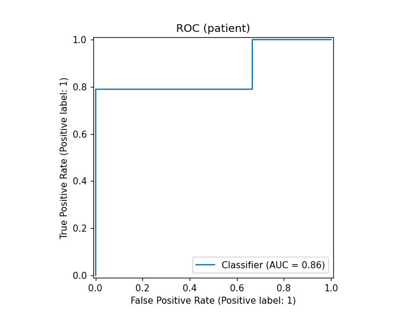
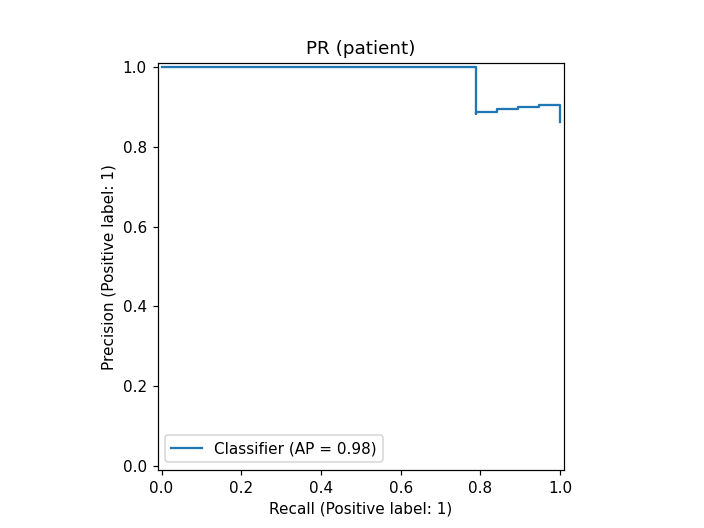
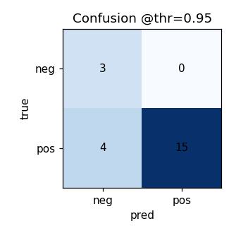
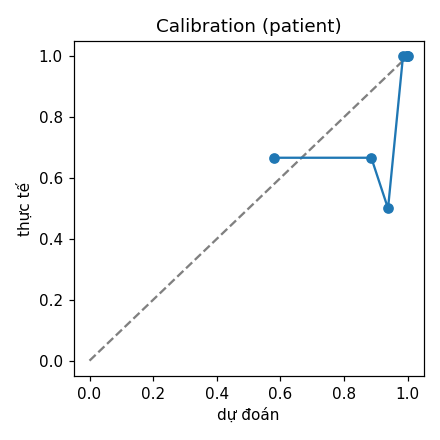
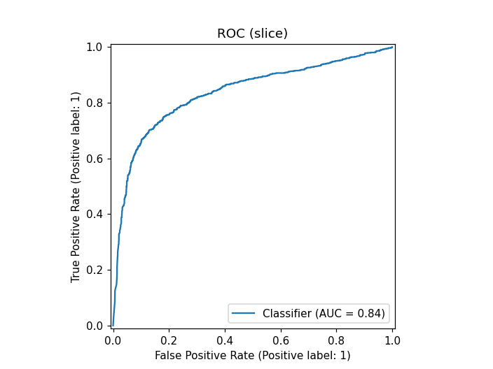

# T3_W2 — Báo cáo Tuần 2: Training pipeline & Baseline (Milestone M2)

> **Dự án:** Liver Cancer AI — phân loại slice CT có/không tổn thương gan → gộp patient-level.
> **Người thực hiện:** Hoàng Đức Trường · **Ngày:** 21/07/2026 · **Định vị:** Research Use Only (RUO), chưa kiểm định lâm sàng.
>
> **Tóm tắt:** Hoàn thiện pipeline train→eval (config-driven, chạy Kaggle GPU), huấn luyện **baseline ResNet-50 (fold 0)** end-to-end → **đạt Milestone M2**. Bổ sung **đánh giá slice-level** (đơn vị ổn định hơn patient-level khi ít ca âm) với CI cluster-bootstrap theo bệnh nhân. **Mốc baseline chính thức: slice-AUROC = 0.837 [0.757–0.892]**. Đây là *proof-of-concept một fold*, chưa phải số baseline cuối (cần 5-fold CV + external).

---

## 1. Mục tiêu tuần 2
- Hoàn thiện pipeline **training + evaluation** (config-driven, seed cố định, log MLflow).
- Chạy **baseline** end-to-end trên dữ liệu W1 (`lits-processed`), báo cáo AUROC + 95% CI ở **cả slice-level và patient-level**.
- **Tiêu chí M2:** pipeline train→eval→checkpoint chạy trọn; có AUROC + CI đáng tin để làm mốc so sánh model chính.

## 2. Thiết lập thí nghiệm

| Hạng mục | Giá trị |
|---|---|
| Dataset | LiTS (`lits-processed`): 19,094 slice có gan / 131 bệnh nhân; pos 36.4% (τ_area=20) |
| Split | Patient-level StratifiedGroupKFold (k=5) + hold-out test 20 bn; seed=42; **hash `8647d40`** |
| Fold dùng | **fold 0** — train 13,482 slice (89 bn) · val 2,555 slice (22 bn) |
| Model | **ResNet-50** (ImageNet pretrained, timm), 1 logit; drop_rate 0.1 |
| Input | slice 256×256, windowing gan WL50/WW350, liver-ROI crop, 3 kênh, normalize ImageNet |
| Loss / imbalance | BCEWithLogits + `pos_weight=1.85` (auto = N_neg/N_pos) |
| Optim | AdamW, discriminative LR (head 3e-4 / backbone 1e-4), cosine + warmup 1 ep, grad-clip 5.0, AMP |
| Chọn best-ckpt / early-stop | theo **`slice_auroc`** (ổn định hơn patient khi val ít ca âm); patience 5 |
| Aggregation slice→patient | mean-of-top-k (k=3); nhãn bn = max nhãn slice |
| Phần cứng | Kaggle GPU **T4** (1 GPU); ~1.3 phút/epoch |

## 3. Nhật ký huấn luyện

| Epoch | train_loss | **slice_auroc** | patient_auroc | CI (patient) | PR-AUC (patient) | Sens@Spec90 (patient) |
|---:|---:|---:|---:|:--:|---:|---:|
| 1 | 0.8793 | 0.591 | 0.386 | [0.00, 0.75] | 0.820 | 0.000 |
| 2 | 0.7236 | 0.761 | 0.702 | [0.33, 0.95] | 0.945 | 0.421 |
| 3 | 0.4887 | 0.817 | 0.860 | [0.65, 1.00] | 0.978 | 0.737 |
| 4 | 0.3868 | 0.825 | 0.860 | [0.67, 1.00] | 0.979 | 0.789 |
| 5 | 0.3202 | 0.824 | 0.877 | [0.70, 1.00] | 0.982 | 0.842 |
| 6 | 0.2719 | 0.830 | 0.895 | [0.75, 1.00] | 0.985 | 0.895 |
| 7 | 0.2483 | 0.827 | 0.912 | [0.75, 1.00] | 0.987 | 0.842 |
| **8** | **0.2217** | **0.837** | 0.860 | [0.65, 1.00] | 0.978 | 0.789 |
| 9 | 0.2128 | 0.829 | 0.842 | [0.62, 1.00] | 0.975 | 0.737 |
| 10 | 0.1844 | 0.810 | 0.947 | [0.83, 1.00] | 0.992 | 0.895 |
| 11 | 0.1752 | 0.820 | 0.895 | [0.67, 1.00] | 0.983 | 0.737 |
| 12 | 0.1631 | 0.815 | 0.912 | [0.75, 1.00] | 0.987 | 0.842 |
| 13 | 0.1624 | 0.826 | 0.895 | [0.70, 1.00] | 0.984 | 0.789 |

**Best model = Epoch 8** (slice_auroc **0.837**). Early-stopping sau Epoch 13.
**Quan sát then chốt:** `slice_auroc` **ổn định** (0.81–0.84 sau hội tụ, ±0.01) trong khi `patient_auroc` **dao động loạn** (0.84–0.95). Nếu chọn model theo patient_auroc sẽ vớ phải đỉnh nhiễu (vd Epoch 10 patient=0.947 nhưng slice chỉ 0.810) → **chọn theo slice_auroc nguyên tắc hơn**.

## 4. Đánh giá trên validation (best checkpoint, Epoch 8)

```json
{
  "n_patients": 22, "n_pos": 19,
  "auroc": 0.8596, "pr_auc": 0.9783, "sens_at_spec90": 0.7895,
  "threshold": 0.9492, "sensitivity": 0.7895, "specificity": 1.0, "precision": 1.0,
  "f1": 0.8824, "accuracy": 0.8182, "tp": 15, "fp": 0, "tn": 3, "fn": 4,
  "ci_low": 0.65, "ci_high": 1.0,
  "slice_n": 2555, "slice_pos": 923,
  "slice_auroc": 0.8369, "slice_pr_auc": 0.7721, "slice_sens_at_spec90": 0.6544,
  "slice_threshold": 0.5337, "slice_sensitivity": 0.7031, "slice_specificity": 0.8689,
  "slice_f1": 0.7268, "slice_accuracy": 0.809,
  "slice_auroc_mean": 0.8354, "slice_ci_low": 0.7569, "slice_ci_high": 0.8915
}
```

### 4.1. So sánh Patient-level vs Slice-level (vì sao dùng slice làm mốc)

| Chỉ số | Patient-level (22 bn, 3 âm) | Slice-level (2,555 slice, 1,632 âm) |
|---|---|---|
| **AUROC** | 0.860, **CI [0.65, 1.00]** *(rộng, ít dùng được)* | **0.837, CI [0.757, 0.892]** *(ổn định)* |
| **PR-AUC** | 0.978 *(thổi phồng do prevalence 86%)* | **0.772** *(giá trị thật, prevalence 36%)* |
| **Threshold (Youden)** | 0.949 *(overfit, cao bất thường)* | **0.534** *(hợp lý)* |
| Sens / Spec @ threshold | 0.789 / 1.000 *(spec từ 3 ca âm → vô nghĩa)* | 0.703 / 0.869 *(từ 1,632 slice âm → tin được)* |
| Sens @ Spec=0.90 | 0.789 | **0.654** |

> **Kết luận:** **slice-AUROC = 0.837 [0.757–0.892]** là **mốc baseline chính thức**. PR-AUC thật chỉ **0.77** (không phải 0.98 như patient) → model là baseline *khá tốt nhưng còn nhiều dư địa cải thiện*. Threshold vận hành hợp lý ~0.53 (sens 0.70 / spec 0.87).

### 4.2. Đường cong đánh giá

| ROC (patient) — AUROC 0.860 | PR (patient) — 0.978 (thổi phồng) |
|:--:|:--:|
|  |  |

| Confusion (@thr=0.95) — TP15/FP0/TN3/FN4 | Calibration (patient) — zigzag do 22 bn |
|:--:|:--:|
|  |  |

**ROC slice-level — AUROC 0.837 (đường mượt, 2,555 mẫu → đáng tin hơn ROC patient):**



## 5. Đánh giá & hạn chế

**Điểm tích cực**
- Pipeline train→eval→checkpoint hoàn chỉnh, tái lập được (config + seed + split hash `8647d40`).
- Model có năng lực phân biệt thực: **slice-AUROC 0.837, CI [0.757, 0.892]** (bootstrap mean 0.835), hội tụ ổn định.
- Đã có **metric đơn vị ổn định (slice)** để so sánh backbone công bằng ở Pha 1.

**Hạn chế phải nêu rõ**
- **Patient-level 1 fold không đáng tin**: val chỉ 22 bệnh nhân / **3 ca âm** → Specificity, Precision, PR-AUC, threshold ở mức bệnh nhân đều nhiễu/thổi phồng. Biểu hiện trực tiếp của hạn chế dữ liệu (chỉ 13/131 ca không u — xem DATA_CARD).
- **CI slice [0.757, 0.892] vẫn hơi rộng** (chỉ 22 bn ở val) → *một fold chưa đủ để phân định 2 model gần nhau*.
- PR-AUC slice 0.77 cho thấy còn nhiều slice khó (rìa tổn thương, isoattenuating).

**Kết luận:** Coi **slice-AUROC 0.837 là mốc baseline (proof-of-concept một fold), KHÔNG phải số cuối.** Con số chính thức cần **5-fold CV gộp (OOF) + external IRCADb**.

## 6. Milestone
| Mốc | Trạng thái |
|---|---|
| **M2 — Baseline end-to-end có AUROC + CI (slice & patient)** | ✅ **ĐẠT** |

## 7. Việc tiếp theo (đề xuất)
1. **Model chính ConvNeXt V2** + Pha 1 sàng lọc backbone (EfficientNet-B0, FastViT, Swin V2) — **xếp hạng theo `slice_auroc`** (so với mốc 0.837).
2. **Pha 2 nghiêm ngặt**: finalist × 5-fold OOF × nhiều seed → slice-AUROC + CI hẹp + threshold khóa → *số baseline "thật"*.
3. **External IRCADb** (~25% ca âm) — nơi Specificity mức bệnh nhân mới có ý nghĩa.
4. Grad-CAM + error analysis (W4).

## 8. Tái lập
- **Code:** GitHub `hdtruong802/HCC-TACE-Assist`, branch `main`.
- **Data:** Kaggle `marcohoang/lits-processed` (`images_u8.npy` + `manifest.csv` + `splits/lits_v1.json`, hash `8647d40`).
- **Lệnh:**
  ```bash
  python -m src.training.train    --config configs/train/base.yaml --arch resnet50 --fold 0
  python -m src.evaluation.evaluate --config configs/train/base.yaml \
      --ckpt outputs/resnet50_fold0/best.ckpt --split val --fold 0
  ```
- **Config:** `configs/train/base.yaml` (`select_metric: slice_auroc`).
- **Artifacts:** `outputs/resnet50_fold0/{best.ckpt, val_metrics.json, eval_val/*.png}`.

---
> **Disclaimer y tế:** Research Use Only — chưa kiểm định lâm sàng. Số liệu là kết quả *một fold* trên tập validation nhỏ (22 bệnh nhân), mang tính proof-of-concept; không dùng để tuyên bố hiệu năng lâm sàng. Kết quả cuối sẽ báo cáo với 5-fold CV + 95% CI + external validation + limitations.
